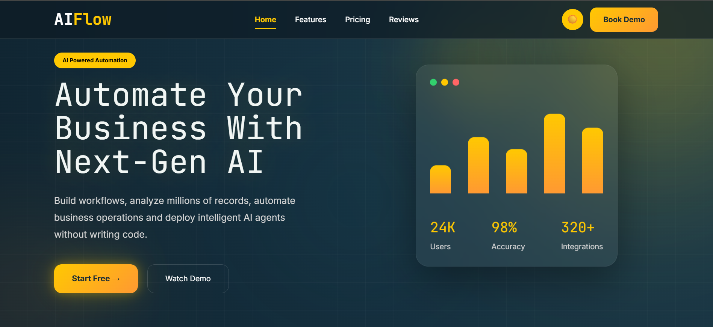
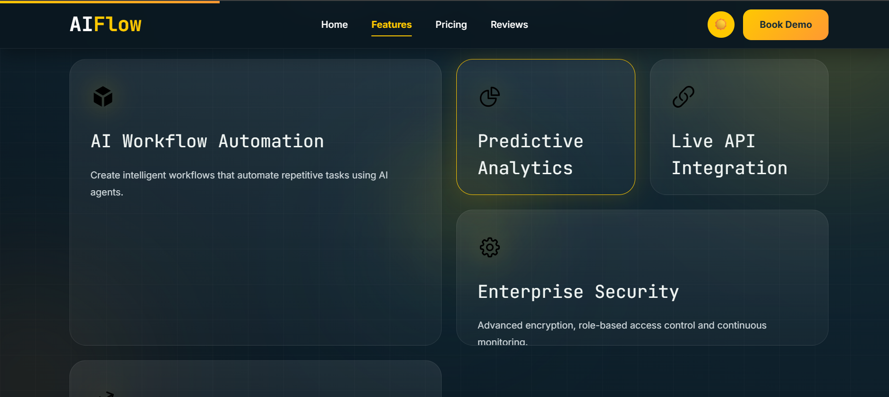
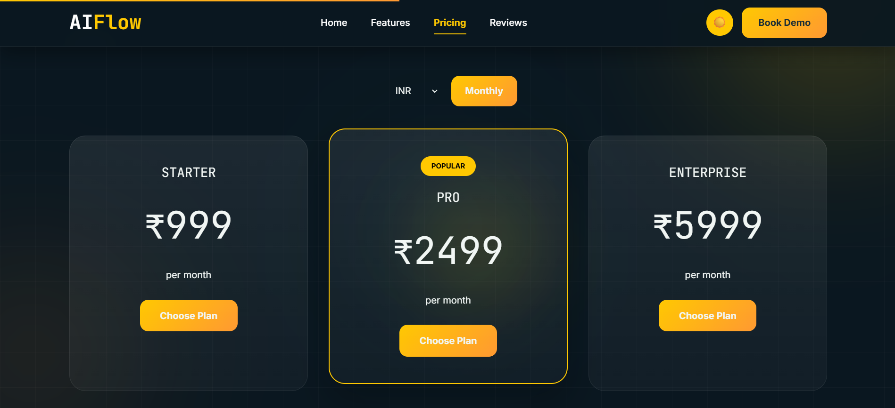
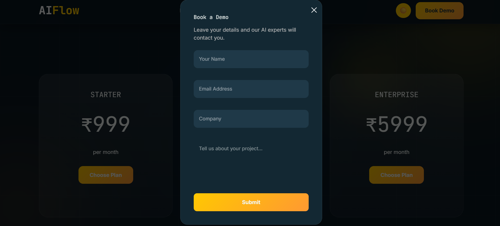

# 🤖 AIFlow

> Automate Your Business With Next-Gen AI

AIFlow is a modern AI SaaS landing page built with React and Vite. It features a premium dark UI, responsive design, animated components, theme switching, pricing section, testimonials, contact form, and EmailJS integration for demo requests.

---

## 🌐 Live Demo

🔗 https://ai-flow-rouge.vercel.app

---

## ✨ Features

- Modern SaaS Landing Page
- Responsive Design
- Dark / Light Theme Toggle
- Smooth Scrolling Navigation
- Active Navbar Links
- Animated Hero Section
- Animated Statistics Counter
- Feature Cards
- Pricing Plans
- Customer Testimonials
- Contact CTA Section
- Book Demo Modal
- EmailJS Integration
- Scroll Animations (AOS)
- Clean UI/UX
- Mobile Friendly
- Vercel Deployment

---

## 🛠 Tech Stack

### Frontend

- React.js
- Vite
- CSS3

### Libraries

- AOS (Animate On Scroll)
- EmailJS
- React Hooks

### Deployment

- Vercel

---

## 📂 Folder Structure

src/
│
├── components/
│ ├── Navbar/
│ ├── Hero/
│ ├── Features/
│ ├── Pricing/
│ ├── Reviews/
│ ├── ContactCTA/
│ ├── Footer/
│ ├── DemoModal/
│ └── ThemeToggle/
│
├── hooks/
│ └── useCounter.js
│
├── App.jsx
└── main.jsx

---

## 🚀 Installation

Clone the repository

```bash
git clone https://github.com/HIMANSHUSINGH1511/AIFlow.git
```

Move into project

```bash
cd AIFlow
```

Install dependencies

```bash
npm install
```

Run project

```bash
npm run dev
```

---

## 📸 Screenshots

## 🏠 Hero Section

<p align="center">
  
</p>

---

## ✨ Features

<p align="center">
  
</p>

---

## 💰 Pricing

<p align="center">
  
</p>

---

## 📩 Demo Modal

<p align="center">
  
</p>

---

## 📧 Contact Form

The contact form is powered by **EmailJS**.

Users can:

- Enter their details
- Request a demo
- Receive confirmation instantly
- Send information directly to the admin email

---

## 🎯 Future Improvements

- Authentication
- Dashboard
- AI Chatbot
- Analytics Dashboard
- Blog Section
- Multi-language Support
- Stripe Payments
- Admin Panel

---

## 👨‍💻 Developer

**Himanshu Singh**

GitHub

https://github.com/HIMANSHUSINGH1511

LinkedIn

www.linkedin.com/in/himanshu-singh-a7738b380

---

## 📄 License

This project is licensed under the MIT License.

---

⭐ If you like this project, don't forget to star the repository.
